```{r setup, include=FALSE}
knitr::opts_chunk$set(echo = TRUE)
library(knitr)
library(dplyr)
library(ggplot2)
library(here)
library(sjPlot)
```

## Overview

This analysis is trying to get a handle on how weather (particularly temperature) is related to corticosterone in tree swallows. Samples are from adults and nestlings measured in Ithaca from 2013-2020. Samples collected after direct manipulations are excluded, but some samples after manipulations that we don't think had any impact on corticosterone are still included (e.g., color manipulations). Samples that are collected after injections other than post-dex are also excluded. There is probably a bit more cleaning and checking that could be done here for a final analysis, but this should be pretty good as a general overview given how large the sample sizes are. Weather data is from the Ithaca Airport or Game Farm Road station and is summarized in various ways as described below.

For each combination of weather variable and cort measurement, I'm fitting essentially the same models that are as simple as possible. Basically, they include just latency and (usually) random effects for year and individual identity. In some cases the random effects are estimated at 0 and are removed to get around errors (they explain no variance). For females, I also have a categorical predictor for capture number, wich roughly equals early incubation (intercept), late incubation (capture 2), and provisioning (capture 3). Males and nestlings don't have that since they are almost exclusively samples from ~day 4-8 (males) and day 12 (nestlings) after hatching. The plots are not controlling for the other variables that are in the models, they are just straight scatter plots for illustration. The fit lines are simple loess smoothed regressions so also aren't controlling for anything. More could of course be done for any of these that we want to follow up on in more detail.

In some cases, I'm also modeling and plotting log values because a few points skew so high that it's hard to see them. I've also trimmed the y-axis in some cases so that a few of the very highest value points are not visible in plots (e.g., in some basecort plots there are a handful of points >50 ng/ul but expending the y axis that high makes it impossible to see anything in the normal range).

One important thing to note is that the x axes differ between figures because nestlings and males are only ever sampled later in the season and because of that we have much less data (or none) at some of the very lowest temperatures that females are sampled at. There are obviously a lot of different plots here and more different ways of summarizing weather that we could think about, and the exact relationships or strength of patterns can differ between some of these choices, but I think the main summary points are:

- Cold temperature results in higher corticosterone across the board (base, induced, and post-dex), but strength differs
    - Baseline is higher when colder, relatively weak relationships 
    - Stress-induced is higher when colder and these are by far the strongest relationships, especially for females
    - Post-dex might be a bit higher when colder, but these are really really weak relationships 
- Temperature explains a pretty small percent of the variation in corticosterone (small r-squared values)
- Speaking **very** roughly, there is often an inflection point around 15 C, below which corticosterone goes up
- In general, the choice of exact temperature metric doesn't make a huge difference, at least qualitatively

# Baseline Corticosterone

## Temperature around capture

This is using the average temperature for the three hours immediately before capture. The exact time of day included differs depending on the time of capture and is much later for nestlings. I did just the morning for females because not all entries in the database had times carried over and they're all captured at similar times. Males and nestlings are more variable so I used the three hours prior even though that excluded some records. 

### Table: base cort vs. immediate temp

```{r echo = FALSE}
m <- readRDS(here::here("5_other_outputs/table1.rds"))
m
```
 
### Figure: base cort vs. immediate temp

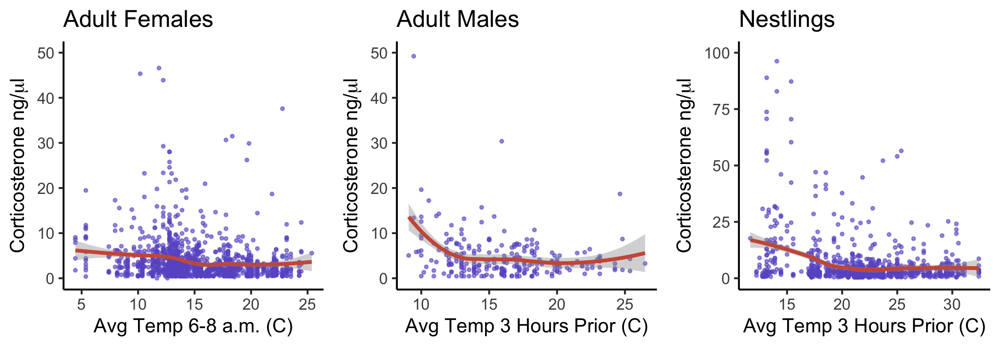\

### Table: log base cort vs. immediate temp

```{r echo = FALSE}
m <- readRDS(here::here("5_other_outputs/table2.rds"))
m
```

### Figure: log base cort vs. immediate temp

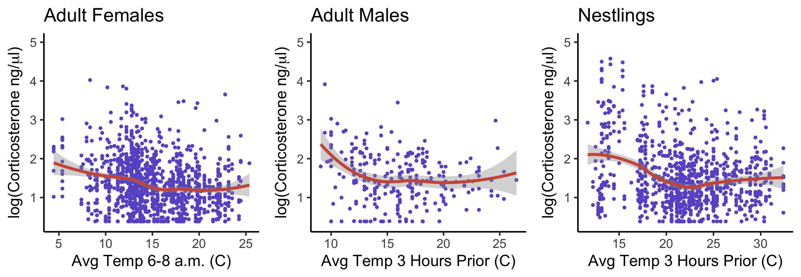\

## Average temperature night before capture

Here I'm using the average temperature from 10pm to 6am on the night before capture. 

### Table: base cort vs. night before

```{r echo = FALSE}
m <- readRDS(here::here("5_other_outputs/table3.rds"))
m
```

### Figure: base cort vs. night before

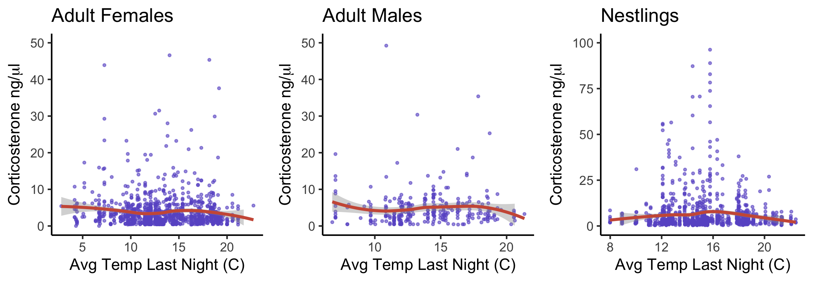\
 
### Table: log base cort vs. night before

```{r echo = FALSE}
m <- readRDS(here::here("5_other_outputs/table4.rds"))
m
```

### Figure: log base cort vs. night before

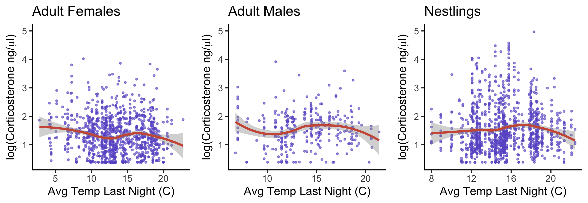\

## Average temperature day before capture

### Table: base cort vs. avg day before

```{r echo = FALSE}
m <- readRDS(here::here("5_other_outputs/table5.rds"))
m
```

### Figure: base cort vs. avg day before

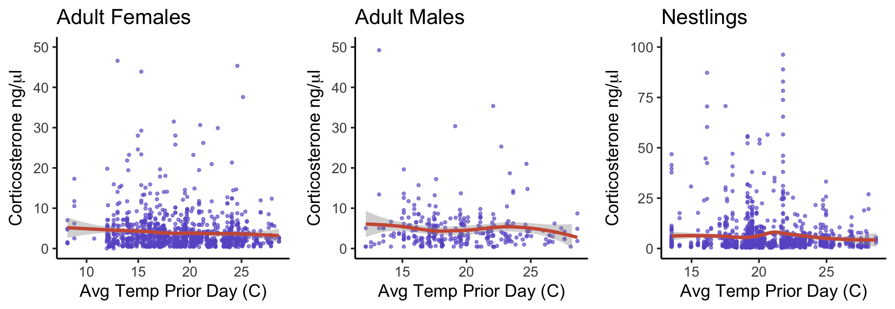\

### Table: log base cort vs. avg day before

```{r echo = FALSE}
m <- readRDS(here::here("5_other_outputs/table6.rds"))
m
```

### Figure: log base cort vs. avg day before

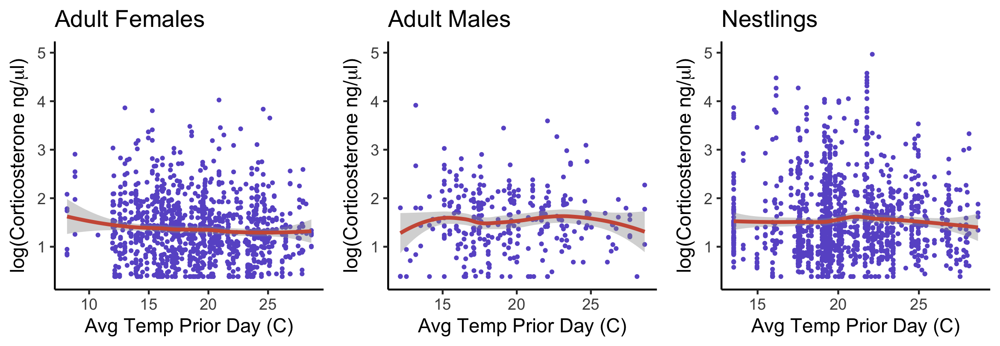\

## High temperature day before capture

### Table: base cort vs. high day before

```{r echo = FALSE}
m <- readRDS(here::here("5_other_outputs/table5b.rds"))
m
```

### Figure: base cort vs. high day before

\

### Table: log base cort vs. high day before

```{r echo = FALSE}
m <- readRDS(here::here("5_other_outputs/table6b.rds"))
m
```

### Figure: log base cort vs. high day before

\

## Average temperature prior 3 days

### Table: base cort vs. prior 3 days

```{r echo = FALSE}
m <- readRDS(here::here("5_other_outputs/table7.rds"))
m
```

### Figure: base cort vs. prior 3 days

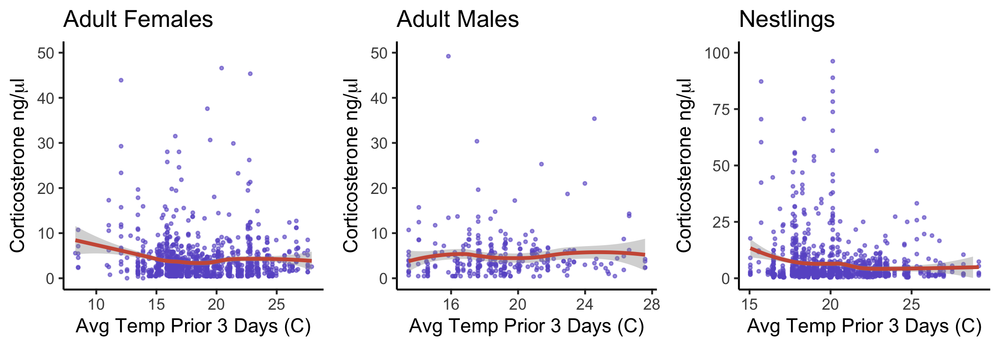\

### Table: log base cort vs. prior 3 days

```{r echo = FALSE}
m <- readRDS(here::here("5_other_outputs/table8.rds"))
m
```

### Figure: log base cort vs. prior 3 days

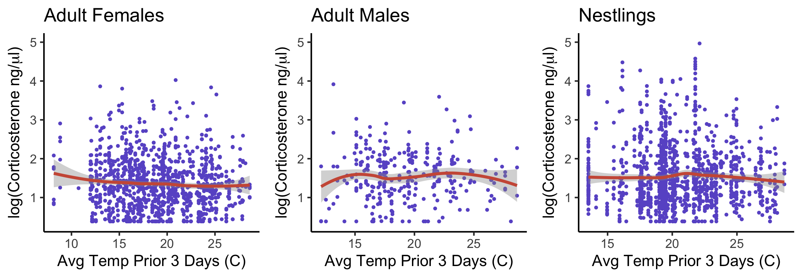\

# Stress-Induced Corticosterone

## Temperature around capture

### Table: stress cort vs. immediate temp

```{r echo = FALSE}
m <- readRDS(here::here("5_other_outputs/table1s.rds"))
m
```
 
### Figure: stress cort vs. immediate temp

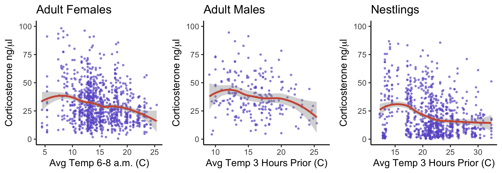\

### Table: log stress cort vs. immediate temp

```{r echo = FALSE}
m <- readRDS(here::here("5_other_outputs/table2s.rds"))
m
```

### Figure: log stress cort vs. immediate temp

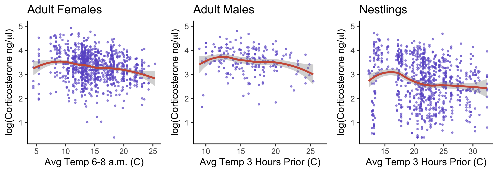\

## Average temperature night before capture

Here I'm using the average temperature from 10pm to 6am on the night before capture. 

### Table: stress cort vs. night before

```{r echo = FALSE}
m <- readRDS(here::here("5_other_outputs/table3s.rds"))
m
```

### Figure: stress cort vs. night before

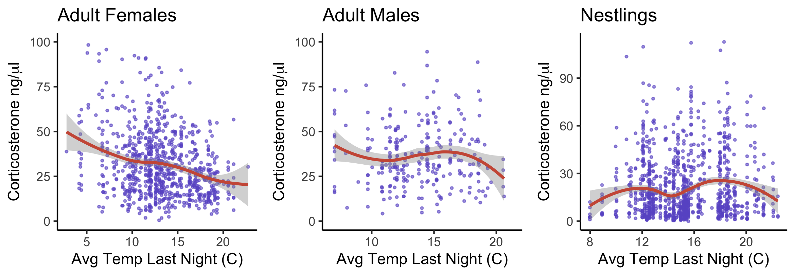\
 
### Table: log stress cort vs. night before

```{r echo = FALSE}
m <- readRDS(here::here("5_other_outputs/table4s.rds"))
m
```

### Figure: log stress cort vs. night before

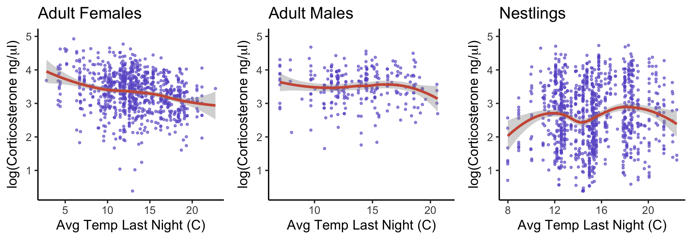\

## Average temperature day before capture

### Table: stress cort vs. avg day before

```{r echo = FALSE}
m <- readRDS(here::here("5_other_outputs/table5s.rds"))
m
```

### Figure: stress cort vs. avg day before

\

### Table: log stress cort vs. avg day before

```{r echo = FALSE}
m <- readRDS(here::here("5_other_outputs/table6s.rds"))
m
```

### Figure: log stress cort vs. avg day before

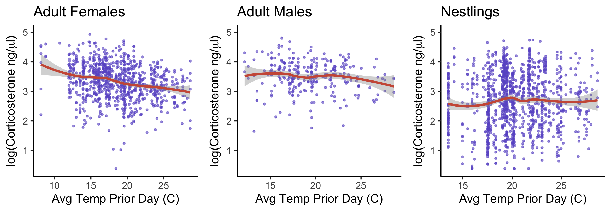\

## High temperature day before capture

### Table: stress cort vs. high day before

```{r echo = FALSE}
m <- readRDS(here::here("5_other_outputs/table5bs.rds"))
m
```

### Figure: stress cort vs. high day before

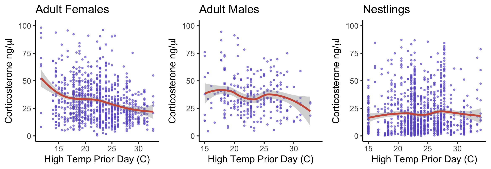\

### Table: log stress cort vs. high day before

```{r echo = FALSE}
m <- readRDS(here::here("5_other_outputs/table6bs.rds"))
m
```

### Figure: log stress cort vs. high day before

\

## Average temperature prior 3 days

### Table: stress cort vs. prior 3 days

```{r echo = FALSE}
m <- readRDS(here::here("5_other_outputs/table7s.rds"))
m
```

### Figure: stress cort vs. prior 3 days

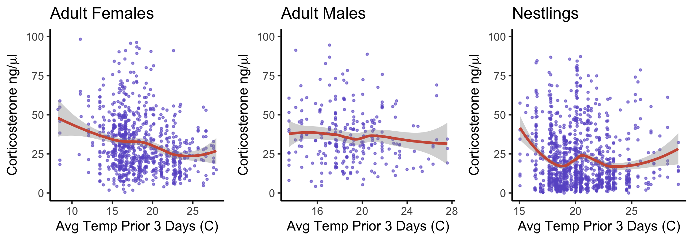\

### Table: log stress cort vs. prior 3 days

```{r echo = FALSE}
m <- readRDS(here::here("5_other_outputs/table8s.rds"))
m
```

### Figure: log stress cort vs. prior 3 days

\

# Post-Dexamethasone Corticosterone


## Temperature around capture

### Table: dex cort vs. immediate temp

```{r echo = FALSE}
m <- readRDS(here::here("5_other_outputs/table1d.rds"))
m
```
 
### Figure: dex cort vs. immediate temp

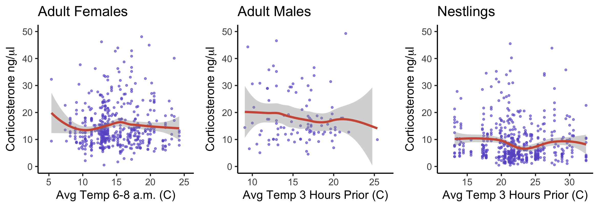\

### Table: log dex cort vs. immediate temp

```{r echo = FALSE}
m <- readRDS(here::here("5_other_outputs/table2d.rds"))
m
```

### Figure: log dex cort vs. immediate temp

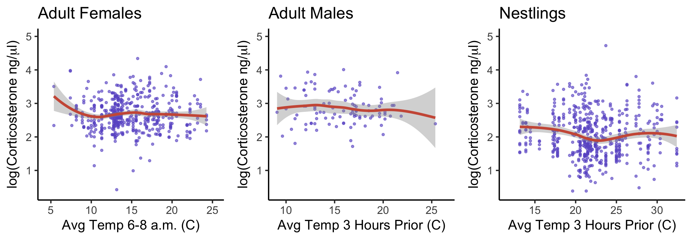\

## Average temperature night before capture

Here I'm using the average temperature from 10pm to 6am on the night before capture. 

### Table: dex cort vs. night before

```{r echo = FALSE}
m <- readRDS(here::here("5_other_outputs/table3d.rds"))
m
```

### Figure: dex cort vs. night before

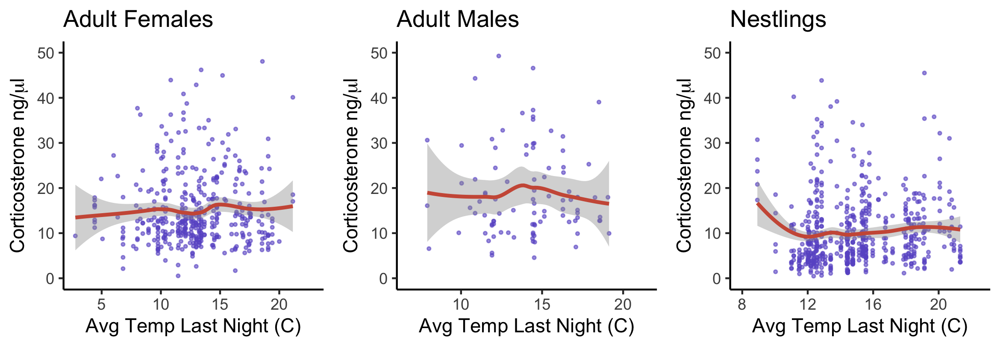\
 
### Table: log dex cort vs. night before

```{r echo = FALSE}
m <- readRDS(here::here("5_other_outputs/table4d.rds"))
m
```

### Figure: log dex cort vs. night before

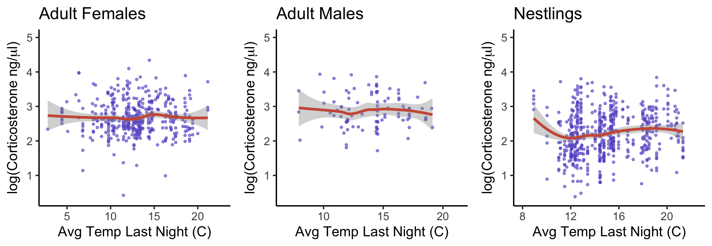\

## Average temperature day before capture

### Table: dex cort vs. avg day before

```{r echo = FALSE}
m <- readRDS(here::here("5_other_outputs/table5d.rds"))
m
```

### Figure: dex cort vs. avg day before

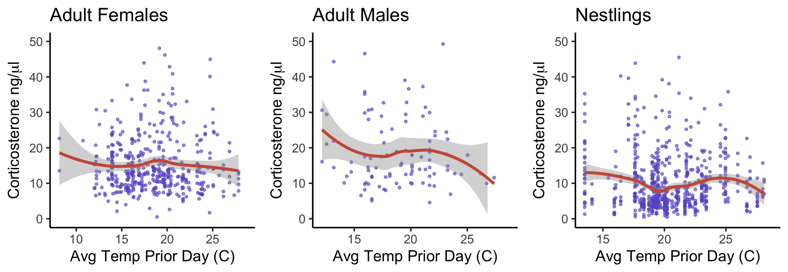\

### Table: log dex cort vs. avg day before

```{r echo = FALSE}
m <- readRDS(here::here("5_other_outputs/table6d.rds"))
m
```

### Figure: log dex cort vs. avg day before

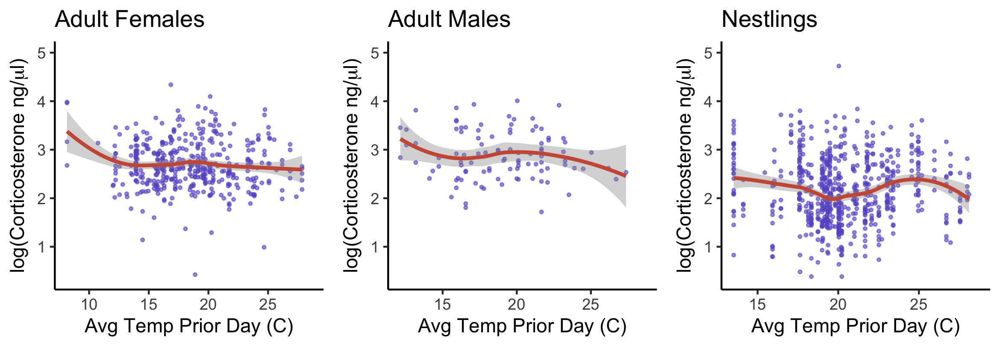\

## High temperature day before capture

### Table: dex cort vs. high day before

```{r echo = FALSE}
m <- readRDS(here::here("5_other_outputs/table5bd.rds"))
m
```

### Figure: dex cort vs. high day before

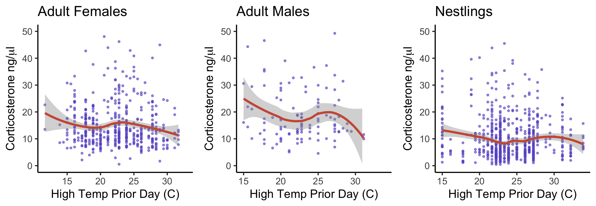\

### Table: log dex cort vs. high day before

```{r echo = FALSE}
m <- readRDS(here::here("5_other_outputs/table6bd.rds"))
m
```

### Figure: log dex cort vs. high day before

\

## Average temperature prior 3 days

### Table: dex cort vs. prior 3 days

```{r echo = FALSE}
m <- readRDS(here::here("5_other_outputs/table7d.rds"))
m
```

### Figure: dex cort vs. prior 3 days

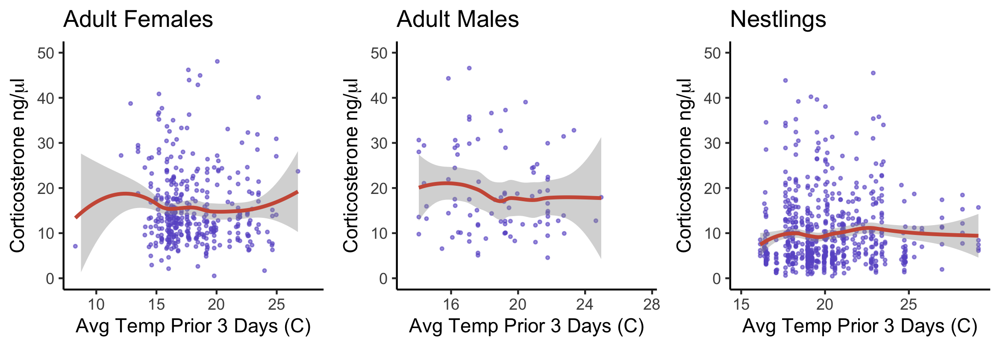\

### Table: log dex cort vs. prior 3 days

```{r echo = FALSE}
m <- readRDS(here::here("5_other_outputs/table8d.rds"))
m
```

### Figure: log dex cort vs. prior 3 days

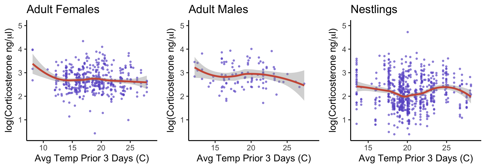\
